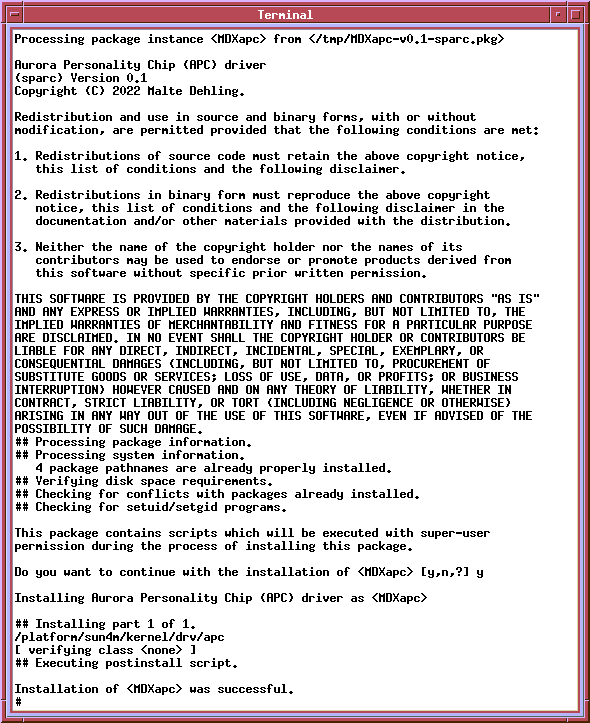

= Aurora Personality Chip (APC) Driver for Solaris 7
Malte Dehling <mdehling@gmail.com>

:imagesdir: https://raw.githubusercontent.com/mdehling/apc-driver/main/

This repository contains a Solaris 7 driver for the Aurora Personality Chip
(APC).  The `qemu-system-sparc` emulator provides an APC implementation for
SPARCstation 4/5 machines and installing this driver dramatically reduces host
CPU usage by letting the host cpu sleep when the Solaris 7 guest is idle
instead of sending it into a busy loop.

WARNING:  This driver is currently *untested* on real hardware.  It is intended
to be installed in QEMU only.

Driver Installation
-------------------
To install the APC driver, simply download the Solaris 7 package
link:MDXapc-v0.1-sparc.pkg[] and run `pkgadd -d MDXapc-v0.1-sparc.pkg`.  This
should show you the license (3-clause BSD) and warn you that you are about to
run the installation script as root.  After installation, the driver is loaded
automatically (no need to reboot) and you should see your host CPU usage drop
quickly.

The driver is currently _not_ automatically loaded at boot time.  To do so, add
`forceload: drv/apc` to your `/etc/system` file.

To uninstall the driver, simply remove the package using `pkgrm MDXapc` and
reboot the system.

Feedback
--------
If you run into any issues using this driver, please let me know exactly what
you did and what happened so that I can try to help you and/or include
appropriate warnings here.

References
----------
- http://cvsweb.netbsd.org/bsdweb.cgi/src/sys/arch/sparc/dev/apc.c[NetBSD APC driver]
